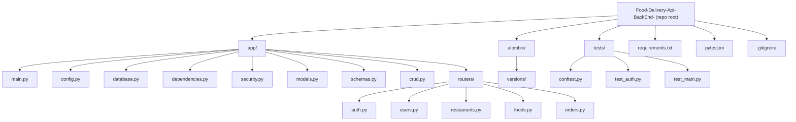

# Food Delivery API (Backend)

A **FastAPI** backend for a food delivery application with **JWT authentication**, **restaurants & menus**, **foods**, and **orders**.  
Built with **async SQLAlchemy + SQLModel** and tested using **pytest**.

---

## Tech Stack

- **Python**
- **FastAPI**
- **SQLModel** (built on SQLAlchemy)
- **Async SQLAlchemy engine / sessions**
- **JWT Auth** (`python-jose`)
- **Password hashing** (`argon2-cffi`)
- **Alembic** (present in repo; migrations folder exists)
- **Pytest** + **pytest-asyncio**

---

## Features

- User registration and login (JWT bearer token)
- Get current user profile
- Create and list restaurants
- Add menu items (link foods to restaurants with price)
- Create food items
- Place orders (calculates total price from menu prices)
- View your order history and order details

---

## Project Structure (Mermaid)



---

## Requirements

- Python **3.10+** recommended
- A database supported by SQLAlchemy async drivers (commonly SQLite or Postgres)

Install dependencies:

```bash
pip install -r requirements.txt
```

---

## Environment Variables

This project loads configuration from a `.env` file (see `app/config.py`).

Create a `.env` file in the repository root:

```env
# Database
DATABASE_URL=sqlite+aiosqlite:///./food_delivery.db

# JWT
JWT_SECRET_KEY=change_me_to_a_long_random_secret
ALGORITHM=HS256
ACCESS_TOKEN_EXPIRE_MINUTES=60
```

### Notes
- `DATABASE_URL` must be an **async** SQLAlchemy URL (example uses `aiosqlite`).
- If you switch to Postgres, you’ll need an async driver (e.g. `asyncpg`) and update dependencies accordingly.

---

## Run the API

From the repo root:

```bash
uvicorn app.main:app --reload
```

API will be available at:

- App: `http://127.0.0.1:8000`
- Swagger UI: `http://127.0.0.1:8000/docs`
- ReDoc: `http://127.0.0.1:8000/redoc`

---

## Authentication

This API uses **OAuth2 Password Flow** with a **Bearer token**.

1. Register a user
2. Login to get `access_token`
3. Use the token as:

```
Authorization: Bearer <access_token>
```

---

## API Endpoints

### Health / Root

| Method | Path | Auth | Description |
|---|---|---:|---|
| GET | `/` | No | Welcome message |

### Auth (`/auth`)

| Method | Path | Auth | Description |
|---|---|---:|---|
| POST | `/auth/register` | No | Create a new user account |
| POST | `/auth/token` | No | Login and get JWT access token |

### Users (`/users`)

| Method | Path | Auth | Description |
|---|---|---:|---|
| GET | `/users/` | Yes | Get current user's profile |

### Foods (`/foods`)

| Method | Path | Auth | Description |
|---|---|---:|---|
| POST | `/foods/` | Yes | Create a new food item |

### Restaurants (`/restaurant`)

| Method | Path | Auth | Description |
|---|---|---:|---|
| POST | `/restaurant/` | Yes | Create a restaurant (owner = current user) |
| GET | `/restaurant/` | No | List restaurants |
| POST | `/restaurant/{restaurant_id}/menu` | Yes | Add a food item to a restaurant menu (only owner) |
| GET | `/restaurant/{restaurant_id}/menu` | No | Get menu for a restaurant |

### Orders (`/order`)

| Method | Path | Auth | Description |
|---|---|---:|---|
| POST | `/order/` | Yes | Place an order (total computed from menu prices) |
| GET | `/order/` | Yes | List current user's orders |
| GET | `/order/{order_id}` | Yes | Get a specific order (only owner) |

---

## Example Requests

### Register

```bash
curl -X POST http://127.0.0.1:8000/auth/register \
  -H "Content-Type: application/json" \
  -d '{"name":"Sagar","email":"sagar@example.com","password":"1234"}'
```

### Login (Token)

FastAPI uses `OAuth2PasswordRequestForm`, so send form data:

```bash
curl -X POST http://127.0.0.1:8000/auth/token \
  -H "Content-Type: application/x-www-form-urlencoded" \
  -d "username=sagar@example.com&password=1234"
```

Response:

```json
{ "access_token": "...", "token_type": "bearer" }
```

### Get My Profile

```bash
curl http://127.0.0.1:8000/users/ \
  -H "Authorization: Bearer <TOKEN>"
```

---

## Running Tests

```bash
pytest
```

---

## Database / Migrations

- The project contains an `alembic/` directory (migrations folder).
- The app also creates tables automatically on startup using:

- `SQLModel.metadata.create_all(...)` in the FastAPI lifespan.

If you want, I can help you standardize this so you use **only Alembic** (recommended for production) and disable auto-create in startup.

---

## License

Add a license if you plan to make this public (MIT / Apache-2.0 / etc).